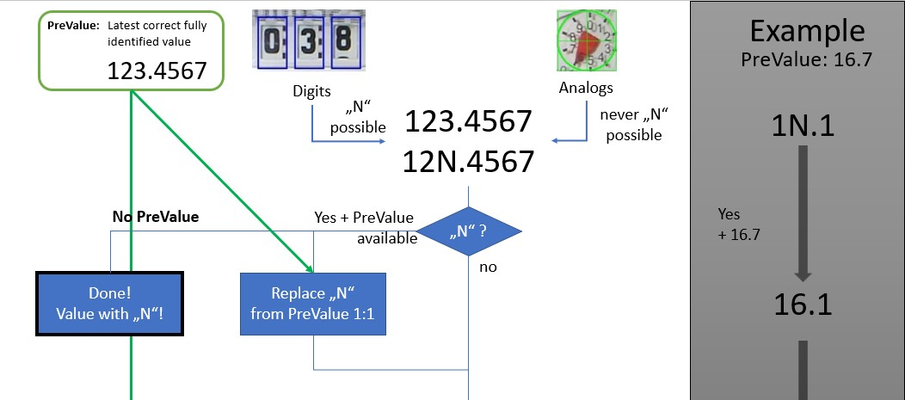
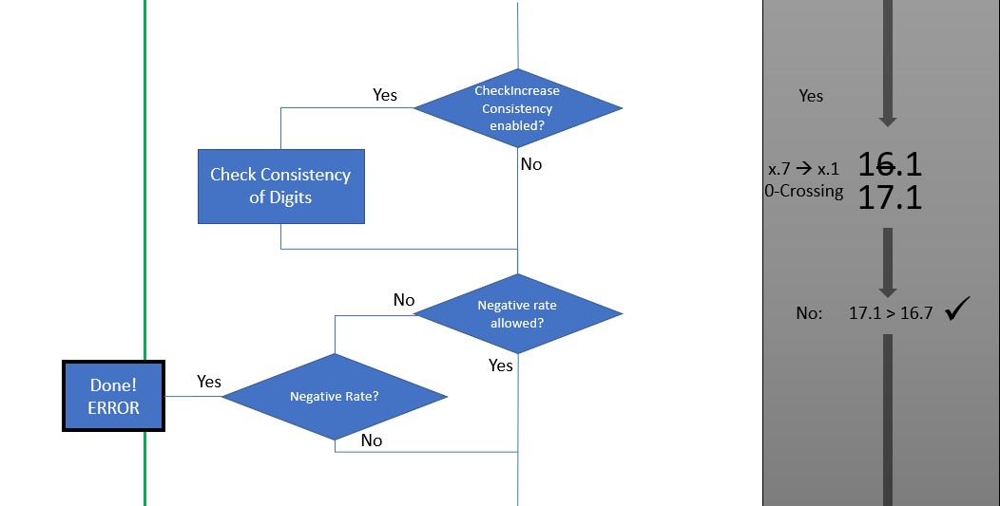
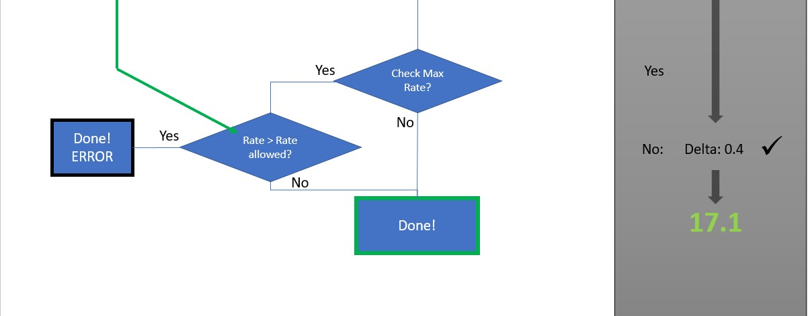
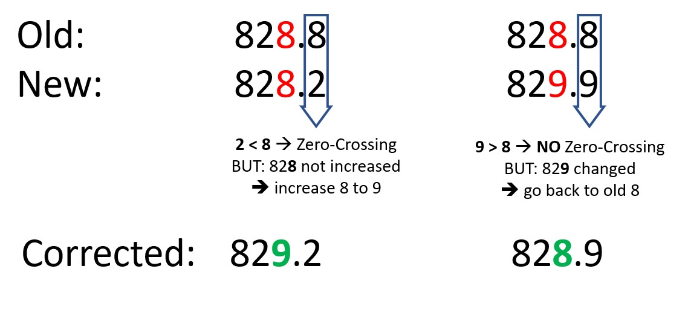

# Correction Algorithm

After the digitization of the images and the composition to a number a checking and correction algorithm is applied. This is explained here.

There are several reasons, that a check might be necessary:

1. In case of digits there is the output of "N" (=NaN = Not-a-Number) in case the digit cannot be detected correctly. This happens for example if the image shows a digit between to states
2. The replacement of the "N" with a previous value could be not sufficient, due to the fact, that it might have changed.
3. There is a misreading of one one of the numbers. This can always happen in case of neural network processing.

### Terms and definitions

##### PreValue

The last correct read value. PreValue is here a bit missleading, because normally it is the same as the last value. In the next round of reading it will be used to check nagtive rates, high rates (MaxRateValue / MaxRateType) and CCheckDigitIncreaseConsistency (dig-class11 only). Either from a previous correctly identified value or manual setting by the user.

##### Digits

Value that are digitized from a digital number. There are 11 allowed values for this: 

1. Digits: 0, 1, 2, ... 9
2. N = Not-a-Number - representing a not unique state between two numbers

##### Analogs

This are value derived from a pointer like meter. This never has the state "N".

##### CheckDigitIncreaseConsistency

If this is enabled an "intelligent" algorithm is used to derive from zero-crossing of discrete digit positions, if the number should have been increased. This is relevant because in some of the digit meters, the increase of a digit to the next number can be seen, before the sub-digit has gone through zero.

For example: 16.6 --> 16.7 --> 1N.8 --> **17.9** corrected to 16.9 --> 17.0 --> 17.1 

As you can see, the 17.9 is a false reading as the 7 is assumed to be already readable, although the sub-digit has not crossed the zero. In this case the CheckDigitIncreaseConsistency algorithm will correct this to 16.9

A detailed description of the algorithm can be found below (not yet ready!)

##### ``AllowNegativeRates``

Most of the meters only have increasing numbers and do not count backwards. Therefore a negative rate (= negative change compared to the PreValue) is surely a false value. This can be checked an flagged as false reading

The ``AllowNegativeRates`` property ensures that the result does not become negative in the event of incorrect readings. This can happen, for example, if the alignment of the image did not work properly. But also the neural networks sometimes flip between two states for similar images.

If ``AllowNegativeRates = true``, the result is discarded if it is smaller than the pre-value of the last readout and the output shows an error "Negative rate.."

If the ``ExtendedResolution`` setting is true, there is an exception where the value does not become smaller, but no error is output. This only applies if the value +/- 0.2 of the last digit is inaccurate.

###### ``DecimalShift``

The ``DecimalShift`` setting puts the decimal point in the right place. It acts like a shift. Negative values shift the decimal point to the left. Positive values move the decimal point to the right, filling with zero.

###### ``AnalogDigitalTransitionStart``

For detailed description see [Analog-digital-transition](Watermeter-specific-analog---digital-transition.md).

###### ``MaxRateValue`` and ``MaxRateType``

Here the maximum change from one to the next reading can be limited. If a false reading of the neural network results in a change larger than this, the reading is flagged as false. There a two types of comparisons possible

1) **AbsolutChange**: Here the difference between the PreValue and the current reading is compared directly, independent how much time has passed since the last reading.
2) **RelativeRate**:  in this case a change rate in the unit of change/minute is calculated, taking the time between the last and the current reading into account. Be careful, that with increasing time, the absolute allowed change increases.
   Example: relative rate of 0.05 m³/minute --> after 20 minutes a maximum change of 20 minutes * 0.05 m³/minute = 1 m³ is possible. That means that a false reading of 1 m³ cannot be detected false after about 20 minutes in this case
   Assume, that there might me no change in the meter for hours (e.g. during the night) a much bigger change could also be accepted. 

###### ``ExtendedResolution``

Newer models such as dig-cont and dig-class100 have a high resolution of the values and can thus represent another digit by using the value of the last digit or pointer (ex. 7.8 in the last digit). 

If the value is set to true, the result of the last digit is used completely. 

When using dig-class11 models, the setting is ignored.

Due to inaccuracies of the neural networks, it sometimes happens that the results jump back and forth between two decimal places. Therefore, when using `ÀllowNegatives``= false, no error is output if the value is only off by 0.2. Nevertheless, the value then remains at the higher determined value.

###### ``IgnoreLeadingNaN``

The parameter is only be used, if a dig-class11 model is selected. ``ÌgnoreLeadingNaN`` removes in the CheckDigitIncreaseConsistency process the leading `N` values.

#### Flow Chart

## CheckDigitIncreaseConsistency Algorithm

The check digit increase consistency algorithm is functional for the digits only. Due to the fact, that the rotation might be a little bit earlier or later compared to the zero crossing of the digit before, errors during the reading before and after a zero crossing can be wrong. Therefore a simple algorithm can be applied, checking the consistency of zero crossing and changes in the following digit. This is applied to one after the other digit, starting with the lowest priority digits.

