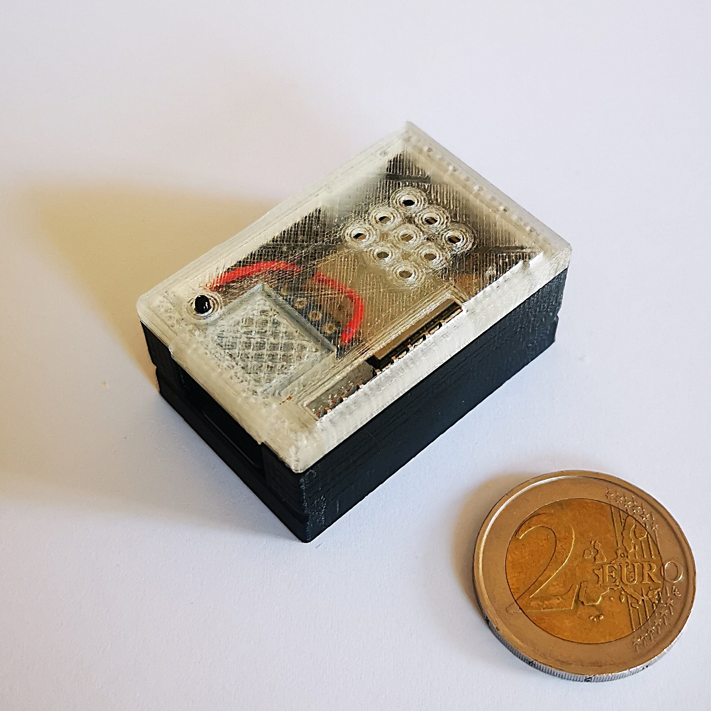
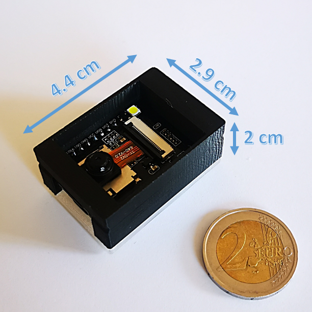
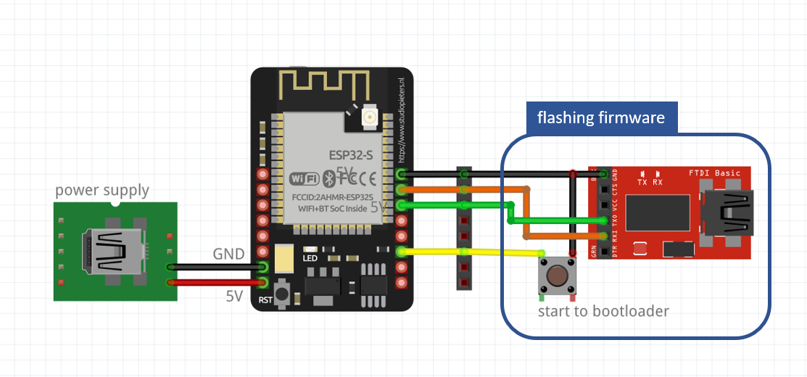
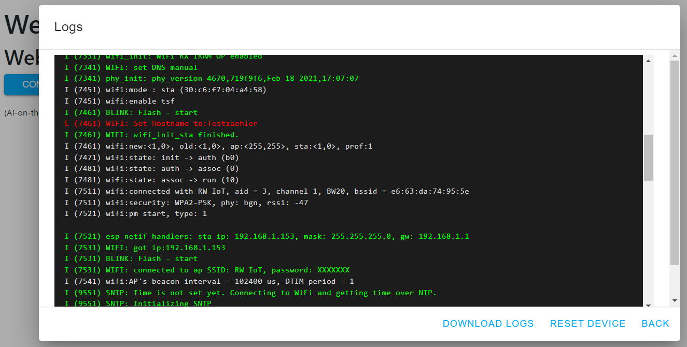
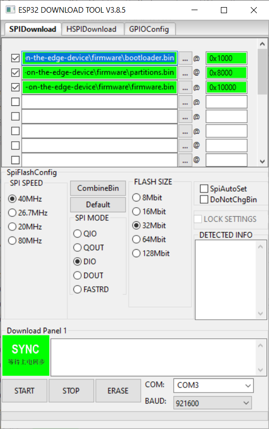

# Installation

The installation requires multiple steps:

1. Get the right hardware and wire it up
1. Flash the firmware onto the ESP32
1. Write the data to the SD-Card
1. Insert the SD-Card into the ESP32 board
1. Power/restart it. 

## Hardware
#### ESP32-CAM

* OV2640 camera module
* Micro SD-Card slot 
* 4 or 8 MB PSRAM. 

It can be easily found on the typical internet stores, searching for ESP32-CAM for less than 10 EUR.
How ever since the hardware is cheap and coming from China, you unluckily could pick a malfunction device. See [Hardware Compatibility](../Hardware-Compatibility) for further advice! 

#### USB->UART interface

For first time flashing the firmware a USB -> UART connector is needed. Later firmware upgrades than can be flashed via OTA.

#### Power supply

For power supply a 5V source is needed. Most easily this can be done via an USB power supply. The power supply should support minimum 500mA. For buffering current peaks some users reported to use a large elco condensator like a 2200uF between ground and VCC.

**:bangbang: Attention:** in several internet forums there are problems reported, in case the ESP32-CAM is only supplied with 3.3V.

#### Housing

A small 3D-printable example for a very small case can be found in Thingiverse here: [https://www.thingiverse.com/thing:4571627](https://www.thingiverse.com/thing:4571627)

{: style="width:200px"}
{: style="width:200px"}


**:bangbang: Attention**: the focus of the OV2640 needs to be adjusted, as it is normally set from ~40cm to infinity. In order to get an image that is big enough, it needs to be changed to about 10cm. Therefore the sealing glue on the objective ring needs to be removed with a scalpel or sharp knife. Afterwards the objective can be rotated clockwise until the image is sharp again.

{: style="width:200px"}


### Wiring

Beside the 5V power supply, only for the first flashing a connection to the USB-UART connector, including a short cut of GPIO0 to GND for bootloader start.

A example for wiring can be found here:




It is also possible to use external LEDs for the illumination instead of the internal flash LED. This is described here: [[External-LED]]


## Firmware flashing
### Files
Grab the firmware from the

 - [Releases page](https://github.com/jomjol/AI-on-the-edge-device/releases) (Stable, tested versions), or the
 - [Automatically build development branch](https://github.com/jomjol/AI-on-the-edge-device/actions?query=branch%3Arolling) (experimental, untested versions). Please have a look on [Living on the Edge](../rolling-installation)] first!

You need:

*   partitions.bin
*   bootloader.bin
*   firmware.bin


### Flashing
There are several options to flash the firmware. Here three are described:

#### 1. Web Installer
There is a Web Installer available which will work right out of the web browser Edge and Chrome.
You can access it with the following link: https://jomjol.github.io/AI-on-the-edge-device

This is the preferred way for beginners as it also allows access to the USB Log:

[](img/web-console.png)

#### 2. Using the Flash Tool from Espressif

The flashing of the firmware can be done  with the "Flash Download Tool" from espressif, that can found [here](https://www.espressif.com/en/support/download/other-tools) 

Download and extract the Flash tool, after starting choose "Developer Mode", then "ESP32-DownloadTool" and you are in the setup of the flashing tool. Connect the ESP32-CAM with the USB-UART connection and identify the COM-Port. 

:bangbang: **Attention**: if you reflashing the code again, it is strongly recommended to erase the flash memory before flashing the firmware. Especially if you used OTA in between, which might cause remaining information on the flash, to still boot from an old image in the OTA-area, which is not erased by a normal flash.

But your ESP32 in bootloader mode and push start, then it will identify the board and you can configure the bin-configuration according to the following table:

| Filename       | Offset  |
|----------------|--------:|
| bootloader.bin | 0x1000  |
| partitions.bin | 0x8000  |
| firmware.bin   | 0x10000 |



Alternatively it can be directly flashed from the development environment - here PlatformIO. But this is rather for experienced users, as the whole development chain needs to be installed for compilation.


#### 3. Using esptool in python directly

For this you need a python environment (e.g. Anaconda in Win10). 
Here you need to install the esptool:

```
pip install esptool
```
Then connect the ESP32 with the USB-UART connector to the system, put it in bootmode and with the following command you can erase the flash and flash bootloader, partitions and firmware in two steps:

```
esptool erase_flash
esptool write_flash 0x01000 bootloader.bin 0x08000 partitions.bin 0x10000 firmware.bin
```
- Maybe you need to specify the COM-port if it is not detected by default.
- If the erase command throws the error `A fatal error occurred: ESP32 ROM does not support function erase_flash.`, your `esptool` might be too old, see https://techoverflow.net/2022/02/08/how-to-fix-esp32-a-fatal-error-occurred-esp32-rom-does-not-support-function-erase_flash/

With some Python installations this may not work and you’ll receive an error, try `python -m pip install esptool` or `pip3 install esptool`

Further recommendations can be found on the [espressif webpage](https://docs.espressif.com/projects/esptool/en/latest/esp32/installation.html)

## SD-Card
The software expects a SD-Card prepared with certain directory and file structure in order to work properly.
For the first setup take the `AI-on-the-edge-device__manual-setup__*.zip` from the [Release](https://github.com/jomjol/AI-on-the-edge-device/releases) page, open the zip and extract the whole content of the in the setup file included `sd-card.zip` onto your SD-Card direclty to the root folder.

SD-Card root should look like this:

- config
- demo
- firmware
- html
- img_tmp
- log
- wlan.ini

This initial setup needs to be done only once as further updates of the software are possible with an Over-The-Air update mechanismn.

### Notes

- Due to the limited availability of GPIOs (OV2640, Flash-Light, PSRAM & SD-Card) the communication mode to the SD card is limited to 1-line SD-Mode. It showed up, that this results in problems with very large SD-Cards (64GB, sometimes 32 GB) and some no name low cost SD-cards.
- There must be no partition table on the SD-card (no GPT, but only MBR for the single partition)
- Following setting are necessary for formating the SD-card: **SINGLE PARTITION, MBR, FAT32 - 32K.  NOT exFAT**
- Some ESP32 devices share their SD-card and/or camera GPIOs with the pins for TX and RX. If you see errors like “Failed to connect” then your chip is probably not entering the bootloader properly. Remove the respective modules temporarily to free the GPIOs for flashing. You may find more information about troubleshooting on the [homepage of Espressif](https://docs.espressif.com/projects/esptool/en/latest/esp8266/troubleshooting.html).

**The ESP32 indicates problems with the SD card during startup with a fast not ending blinking.**
**In this case, please try another SD card.** 


## WLAN

The access to the WLAN is configured in the "wlan.ini" directly on the root directory of the sd-card. Just write the corresponding SSID and password before the startup of the ESP32. This file is hidden from external access (e.g. via Filemanager) to protect the password.

After power on the connection status is indicated by 3x blinking of the red on board LED.

WLAN-Status indication:

* **5 x** fast blinking (< 1 second): connection still pending
* **3 x** slow blinking (1 second on/off): WLAN connection established

It is normal that at first one or two times a pending connection is indicated.


## Update (OTA / Over-The-Air)

### Update from version greater than 12.0.0

You can use the over the air update mechanism, which uploads the update via a ZIP files.

The update file is located on the [release page](https://github.com/jomjol/AI-on-the-edge-device/releases). Please choose the zip file with the following naming: `AI-on-the-edge-device__update__*.zip`

Go to the menu `System --> OTA Update` and follow the instructions there. After a final automatic reboot you should have the new version running.


### Update from version older than 12.0.0

If you update from an version older than 12.0.1, you should firstly update to version 12.0.1. Background are not fully backward compatible changes in the `config.ini`, that are taken care of in this version.

:bangbang: **Make sure to read the instructions below carfully!**

1.  Backup your configuration (use the `System -> Backup/Restore` page)!

2.  Upload and update the `update-*.zip` file from the release  **`12.0.1`**  [see here](https://github.com/jomjol/AI-on-the-edge-device/releases/tag/v12.0.1) .

4.  Let it restart and check on the `System -> Info` page that the Firmware as well as the Web UI got updated. If only one got updated, redo the update. If it fails several times, you also can update the Firmware and the Web UI separately.

5.  Safe way: 
    1.  Update first the `firmware.bin` (extract it from one of the provided zip files) and do the Reboot
    2.  Update with the full zip file (`update-*.zip`, ignore the version warning after the reboot)

6.  Please go to `Settings -> Configuration` and address the changed parameters:
    -   DataLogging (storing the values for data graph)
    -   Debug (extended by different debug reporting levels)

7.  Make sure it starts to do the digitalization (check the Error field on the overview page). If it does not start a round within a minute, restart the device.

:bangbang: **If the system is working now without any issues, please open the configuration editor once and save the `config.ini`. This will update the file to the newest content**:bangbang:

Now you can safely update to the newest version.

