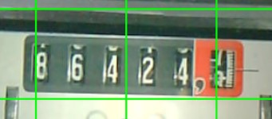
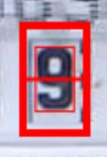
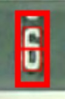
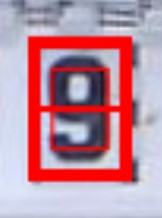

# ROI (Region of Interest)

General remark:
> You are using a neural network approach which is trained to fit as many different type of meters as possible. The accuracy will never be 100%. It is normal to see a missing reading once in a while. There there are several precautions to detect this. For details see the section `PostProcessing` on the configuration page.

The most critical settings for accurate detection are:

1. Correct setting of the **R**egions **O**f **I**nterest (ROIs) for detection of the image.
   > This must be done manually for each meter!
2. Number type is part of the training set.
   > Have a look on the [Digital Counters](https://jomjol.github.io/neural-network-digital-counter-readout/) resp. [Analog Needles](https://jomjol.github.io/neural-network-analog-needle-readout) to check if your types are contained. If your number types are **not** contained, you should take the effort to record them so we can add them to the training data. See: [Learn models with your own images](../Learn-models-with-your-own-images) on how to create new input.

_____

## Correct Setup of ROI
Please proceed in the following order!

Don't forget to save after each step!

### Image Sharpness
Ensure a sharp image of the camera by adjusting the focal length of the ESP OV2640 camera. **Adjust the focus for the clearest possible image!**

In order to use it for reading a meter, the focal-length  of the OV2640 camera has to be manipulated, as by default it only results in sharp image for distance bigger than ~40cm, causing the image of the water meter to be too small for automated readout processing.

**ATTENTION:** this modification will void any warranty, as the sealing of the lens objective is broken!

**ATTENTION:** This modification will render  the camera unsuitable for general, web-cam type applications unless the focal length is changed back to the original setting.

Remove the fixing glue of the OV2640 lens with a sharp knife. After this you can screw the lens in and out. Rotating it by about a quarter of a turn counterclockwise results in a focus plane of about  10cm. You need to figure out your best setting with a little bit of  trial and error for your specific environment.

### Horizontal Alignment
Ensure an **exact horizontal alignment** of the number via the alignment / reference setup:

| :heavy_check_mark: Okay                         | :x: Not Okay                         |
| ------------------------------ | ---------------------------------- |
|  |  |

### Correct Size for ROI
Choose the right size of the ROI:
> The configuration of ROIs differs a bit on the model you choose. Below you find the differences between the different AI models. Pick the one you think fits best your purpose. If you don't get to good result, try another model.

### Model Selection
#### dig-class11 Configuration
dig-class11 - Models recognize the **complete digit only**. Here it is not relevant if the ROI fits the Border of the digit window.

For this model, there should be a border of 20% of the image size around the number itself. This border is shown in the ROI setup image by the inner thinner rectangle. This rectangle should fit perfectly around the number when the number has not started to rotate to the next position: 

|              | Example 1                         | Example 2                         |
| ------------ | --------------------------------- | --------------------------------- |
| :heavy_check_mark: **Okay**     |            |            |
| :x: **Not** Okay |  |  |
| :x: **Not** Okay |    |    |

If you have perfect alignment you and are not getting satisfying results, most probably your numbers are not part of the training data yet. Read on [Learn models with your own images](../Learn-models-with-your-own-images) how to add your meter's type of numbers to the training set.

#### dig-class100 / dig-cont Configuration

These models recognize the tenths (fractions) between the numbers. This model requires a different ROI setup; the height must be set differently and more accurately.

First, the width can be set as for dig-class11, i.e. 20% margin left and right.

The height of the outer rectangle should be set to the upper and lower edge of the number window. To achieve this setting, you need to unlock the aspect ratio:

Here an example:

|              | Example 1                         | 
| ------------ | --------------------------------- | 
| :heavy_check_mark: **Okay**     |           | 
| :x: **Not** Okay |  | 

