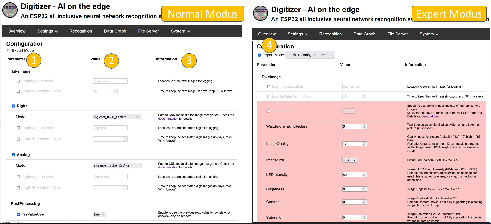
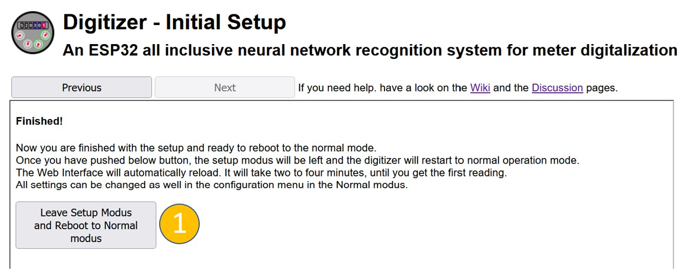

# Initial Setup

After setting up the device (firmware, SD card, WLAN) the device will connect to the wifi access point and start in an initial setup configuration:

{: style="width:500px"}

In the top you can navigate through 5 steps, that guide you through the necessary setup:

1. [Reference Image](Reference-Image.md)
1. [Alignment](Alignment.md)
1. [Digital ROIs](ROI-Configuration.md)
1. [Analog ROIs](ROI-Configuration.md) (Only required in case your meter has analoge pointers)
1. [General Settings](Configuration.md)

All settings can be accessed also later in the normal operation mode.

TODO rework

## 5. General Settings

In the next steps you can configure the behavior and external interfaces in detail:

{: style="width:500px"}

The configuration is divided into different sub topics:

* TakeImage
* Digits
* Analog
* PostProcessing
* MQTT
* InfluxDB
* GPIO Settings
* Autotimer
* DataLogging
* Debug
* System

The details are explained in other parts of the manual (see links (**TBD**))

Some of the sections as well as parameters are mandatory. They can be en/disabled in the first column (1). 
The setting itself is done in the next column (2) and a brief explanation you can find in the last column (3).

Don' t forget to save the settings with "Save" and do not reboot at this stage.

#### Expert Mode

With the normal parameters you should be able to make the needed settings for most of the system. Sometimes there is some fine tunning needed. For this there is an expert mode available. This can be enabled with the check box at the top (4). After this you see much more parameters. But before modifying them you should be really sure, what they are about.

## Finish Setup and change to normal operation

After setting up everything, there is a last step to be done:

{: style="width:500px"}

With (1) you leave the setup mode and reboot to normal operation mode.

## Access to setup in normal operation mode

You can access all the settings also during the normal working mode via the "Settings" menu:

{: style="width:500px"}

(1) Access to configuration parameters

(2) Update of reference image

(3) Update of alignment marks

(4)/(5) Update of the ROI setting
